Playlist generation and playback flow

```mermaid
flowchart LR
    A["Dashboard loads"] --> B["POST /api/playlists/random"]
    B --> C["MoodDiscovery renders prompt ideas"]
    C -->|"User selects another mood"| B
    C -->|"User clicks a prompt"| D["POST /api/playlists/generate"]
    D --> E["GeneratedPlaylist with songs"]
    E --> F["Navigate to /playing?playlist=...&track=0"]
    F --> G["Playing page parses playlist"]
    G --> H["NowPlayingClient renders queue"]
    F --> I["DashboardClientLayout reads same URL"]
    I --> J["RightPanel renders selected song"]
    H -->|"Select song"| K["Update track query parameter"]
    K --> I
    K --> H
```

1. Dashboard loads default prompts
DashboardClient selects a random value from SUPPORTED_MOODS and calls:
POST /api/playlists/random
Content-Type: application/json

{
  "mood": "energetic"
}
The endpoint returns:
{
  "randomPrompts": [
    {
      "prompt": "Cardio Kickstart",
      "description": "High-energy music for a cardio workout.",
      "artistLike": ["Dua Lipa", "Avicii"],
      "moods": ["energetic"]
    }
  ]
}
These are passed into:
<MoodDiscovery defaultPrompts={defaultPrompts} />
2. Selecting a mood generates new prompt ideas
MoodDiscovery initially displays defaultPrompts.
When the user selects a mood:
The previous request is cancelled.
Existing prompt ideas are cleared.
/api/playlists/random is called with the selected mood.
The newly returned prompts replace the default prompts.
Selecting another mood repeats the same process. Request IDs and AbortController prevent older responses from overwriting newer results.
3. Clicking a prompt generates a playlist
When the user clicks a prompt, the application calls:
POST /api/playlists/generate
Content-Type: application/json

{
  "prompt": "Cardio Kickstart"
}
The endpoint returns the GeneratedPlaylist structure:
{
  "playlist": {
    "title": "Cardio Kickstart",
    "description": "A high-energy workout mix.",
    "mood": ["energetic", "upbeat"],
    "songs": [
      {
        "title": "Eye of the Tiger",
        "artist": "Survivor",
        "videoId": "btPJPFnesV4",
        "thumbnail": "https://i.ytimg.com/vi/btPJPFnesV4/hq720.jpg",
        "duration": "4:05"
      }
    ]
  }
}
The wrapper is important. Songs are located at:
generatedPlaylist.playlist.songs
4. Playlist data is placed in the URL
The generated playlist is serialized and encoded:
const playlistParam = encodeURIComponent(
  JSON.stringify(generatedPlaylist)
);

router.push(
  `/playing?playlist=${playlistParam}&track=0`
);
The URL is currently the shared source of truth because the application is not using React context.
It carries:
The generated playlist.
The currently selected track index.
Example:
/playing?playlist=<encoded-playlist>&track=0
5. The playing page parses the playlist
The server-side /playing page reads searchParams.
Next.js already decodes the query value, so the page only runs:
playlist = JSON.parse(
  rawPlaylist
) as GeneratedPlaylist;
It must preserve the complete wrapper and pass it to:
<NowPlayingClient playlist={playlist} />
It should not change the object into playlist.playlist, because NowPlayingClient expects the full GeneratedPlaylist.
6. NowPlayingClient renders the queue
NowPlayingClient reads:
playlist?.playlist?.songs
It converts those songs into queue tracks and passes them to NowPlayingPanel.
Fallback tracks are only used when:
playlist?.playlist?.songs
is missing or empty.
The earlier default-track issue happened because the component was reading:
playlist.tracks
but the API provides:
playlist.playlist.songs
7. Selecting a track updates the URL
When a user selects a queue track, NowPlayingClient changes the track query parameter:
const params = new URLSearchParams(
  searchParams.toString()
);

params.set("track", String(index));

router.replace(
  `/playing?${params.toString()}`,
  { scroll: false }
);
For example:
track=0
track=1
track=6
The playlist does not need to be generated again. Only the selected index changes.
8. The client dashboard layout updates RightPanel
The server dashboard layout handles Supabase authentication and passes the user’s name into DashboardClientLayout.
DashboardClientLayout is a client component that reads the same URL with useSearchParams().
It parses the playlist and finds the selected song:
const songs =
  playlist?.playlist?.songs ?? [];

const currentTrack =
  songs[currentTrackIndex] ?? null;
It then passes the actual song into RightPanel:
<RightPanel
  song={currentTrack}
  mood={playlist?.playlist?.mood?.at(0)}
  playing={playing}
  liked={liked}
  onToggle={handleTogglePlaying}
  onLike={handleToggleLiked}
/>
Changing track in the URL causes both the queue and right panel to display the same song.
9. Track artwork handling
Generated tracks can sometimes contain invalid values such as:
{
  "videoId": "unknown-video",
  "thumbnail": "unknown-thumbnail"
}
Before passing a thumbnail into next/image, EachTrackInPlaylist validates that it is an absolute HTTP/HTTPS URL.
If the thumbnail is invalid but the video ID is valid, it derives:
https://i.ytimg.com/vi/{videoId}/hqdefault.jpg
If both values are invalid, it displays the Music2 icon instead of rendering next/image.
The following hosts are allowed in next.config.ts:
images: {
  remotePatterns: [
    {
      protocol: "https",
      hostname: "picsum.photos",
    },
    {
      protocol: "https",
      hostname: "i.ytimg.com",
      pathname: "/vi/**",
    },
    {
      protocol: "https",
      hostname: "img.youtube.com",
      pathname: "/vi/**",
    },
  ],
}
Current limitations
The full playlist is stored in the URL. Large playlists could eventually exceed practical URL limits. A future version should store playlists in Supabase and put only a playlist ID in the URL.
The queue and right panel synchronize the selected track through track=<index>.
Their play/pause state is currently local to separate client components. The selected song synchronizes, but every playback control will not remain synchronized until playback state is also stored in the URL, lifted into one common client component, or managed by a shared store.
Play and pause currently represent UI state unless Player is connected to an actual YouTube/audio player.
Tracks with unknown videoId values can be displayed safely but cannot be played until the API resolves valid media metadata.